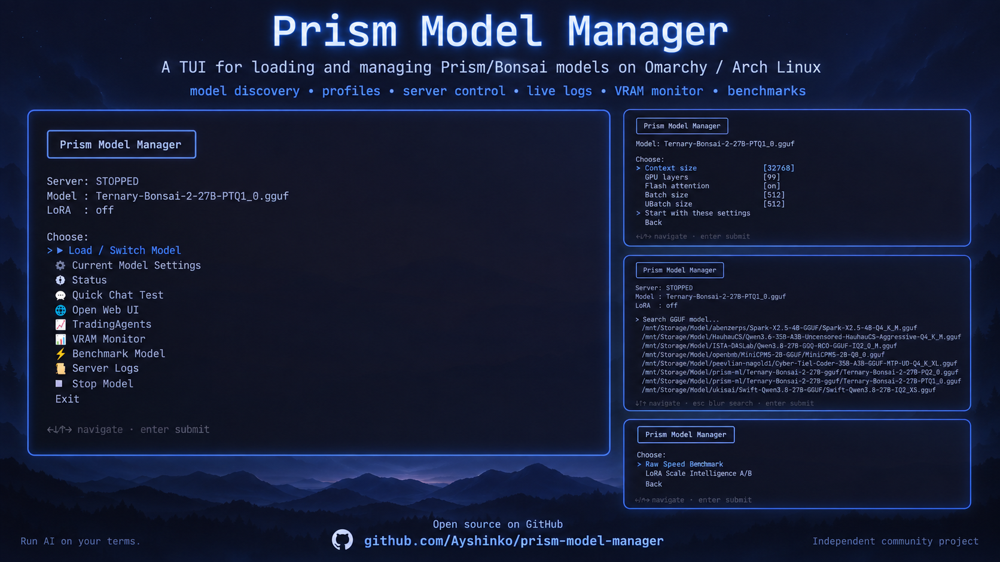
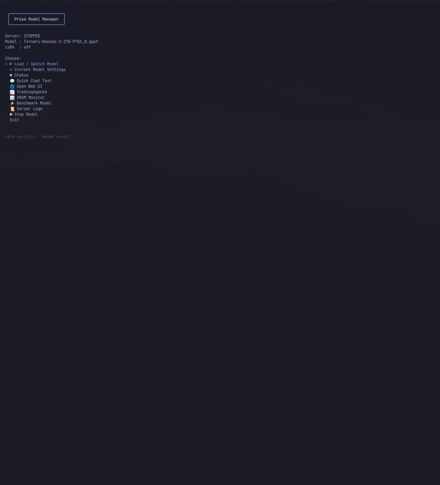
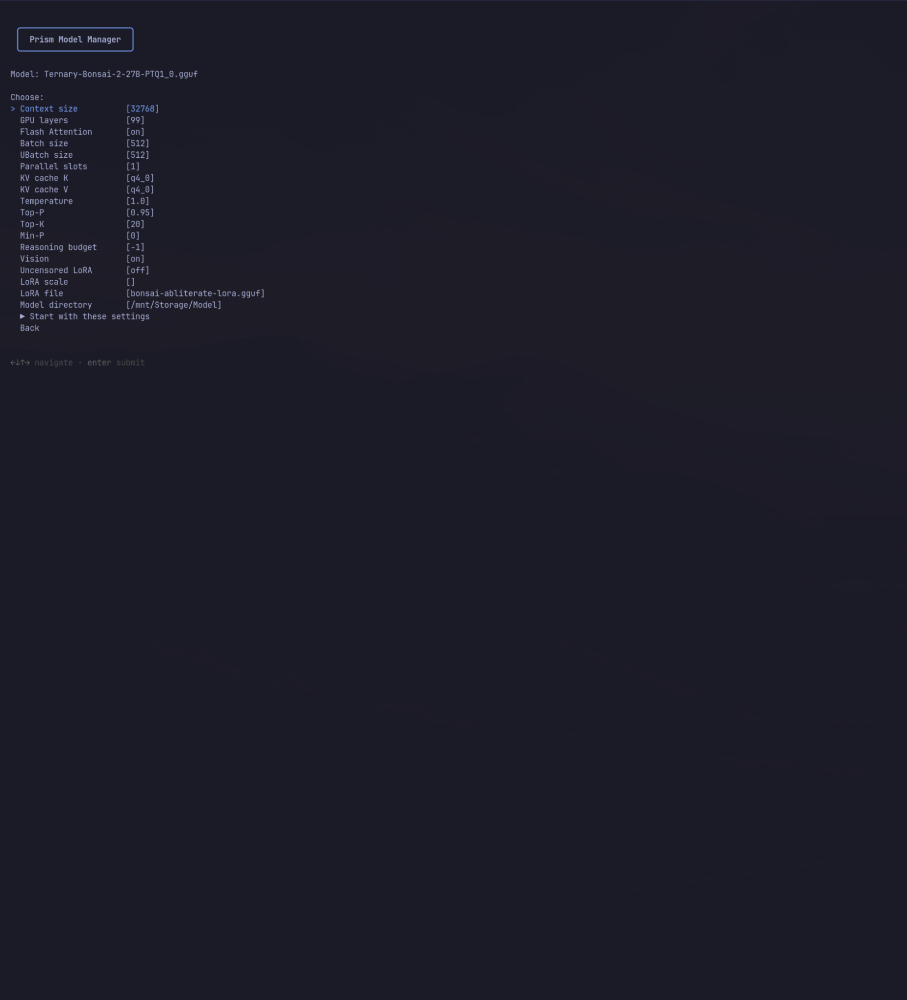
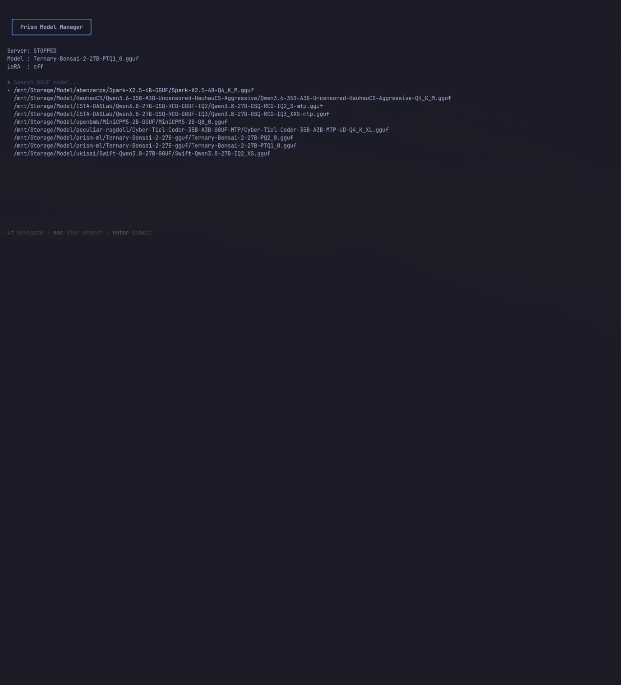

# Prism Model Manager

> A simple TUI for loading and managing Prism/Bonsai models on Omarchy / Arch Linux.

[](https://github.com/Ayshinko/prism-model-manager/releases/latest)
[](https://opensource.org/licenses/MIT)
[](https://github.com/Ayshinko/prism-model-manager)
[](https://github.com/omacom/omarchy)

Prism Model Manager is a terminal UI for running and managing PrismML Bonsai GGUF models with the Prism llama.cpp fork.

It handles model discovery, per-model profiles, server start/stop, inference settings, live logs, VRAM monitoring, quick chat tests and benchmarks without having to maintain long llama-server commands manually.

**Independent community project. Not affiliated with, endorsed by, or maintained by PrismML.**

<p align="center">
  
</p>

Version **3.1.0**, licensed under the [MIT License](LICENSE).
Copyright (c) 2026 Ayshinko. Models and runtimes are not bundled and retain their
own licenses. [GitHub repository](https://github.com/Ayshinko/prism-model-manager).

Originally developed on **Omarchy / Arch Linux**. The launcher uses standard Linux
command-line tools and does not depend on Hyprland or an Omarchy desktop session.
Other distributions may work with the dependencies below; they have not been
validated by the maintainer.

## Screenshots

This screenshot shows the 3.1.0 colored interface.

<p align="center">
  
</p>

<p align="center">
  
</p>

<p align="center">
  
</p>

<p align="center">
  
</p>

## What it does

- **Colored dark-mode interface**: Professional dark terminal TUI with semantic colors
- Discover and switch GGUF models
- Save individual model profiles
- Configure context, GPU layers, KV cache and sampling
- Configure max output tokens (`-n` / `--n-predict`) independently from context window
- Start / stop the Prism llama.cpp server
- Follow live server logs
- Display NVIDIA VRAM/utilization and system RAM usage
- Configure MTP and vision projector options with backend capability checks
- Validate settings and ports before launch; report failure and clean up timed-out launches
- Run quick chat tests
- Launch the Web UI
- **Report local API base URL, reachability and running model ID for external clients**
- Run raw speed benchmarks
- Optional LoRA configuration and A/B scoring

## Quick start

### Option 1 (recommended) — Download the integrated release archive

Download the latest integrated release from the [Releases page](https://github.com/Ayshinko/prism-model-manager/releases):

```bash
# Download and extract
wget https://github.com/Ayshinko/prism-model-manager/releases/latest/download/prism-model-manager-3.0-linux-x86_64-cuda.tar.gz
tar xzf prism-model-manager-3.0-linux-x86_64-cuda.tar.gz
cd prism-model-manager-3.0-linux-x86_64-cuda

# Install (verifies backend, installs PMM + backend together)
./install.sh
export PATH="$HOME/.local/bin:$PATH"

# Launch
prism-model-manager
```

The integrated archive contains both PMM 3.0 and a verified PR218-compatible
llama-server inference backend. Users do not need to download, build or locate
llama-server separately. See the [release page](https://github.com/Ayshinko/prism-model-manager/releases)
for current version details and checksums.

### Option 2 — Git clone (source only, no bundled backend)

```bash
git clone https://github.com/Ayshinko/prism-model-manager.git
cd prism-model-manager
./install.sh
export PATH="$HOME/.local/bin:$PATH"
```

The source clone installer does not bundle an inference backend. Users need a
separate compatible llama-server. See the [Releases page](https://github.com/Ayshinko/prism-model-manager/releases)
for the integrated archive with a bundled backend.

## Dependencies

Linux, Bash 4.4+, gum, curl, jq, less, Python 3 (standard library only), GNU
coreutils/findutils, procps-ng (`watch`). `llama-bench` is needed only for benchmarks.
`xdg-open` is optional for the browser UI. NVIDIA monitoring requires a working
driver and `nvidia-smi`. ShellCheck is a recommended development dependency.

**The integrated release archive bundles a CUDA-enabled llama-server.** The bundled
backend requires an NVIDIA GPU with a compatible CUDA driver (R550+ recommended)
and the NVIDIA CUDA runtime libraries (libcuda, cuBLAS). These are **not** bundled
with the package and must be installed on the host system as part of the NVIDIA
driver package. For CPU-only or non-NVIDIA configurations, use Option 2 (Git clone)
with a compatible llama-server from another source.

On Arch Linux / Omarchy, install missing userland dependencies:

On Arch Linux / Omarchy, install missing userland dependencies:

```bash
sudo pacman -S --needed git bash gum curl jq less python coreutils findutils procps-ng util-linux xdg-utils shellcheck
```

The installer does not install packages, change GPU drivers, download models, or
build/download a runtime. Run from an existing terminal; no desktop configuration
changes are required.

## Installation and removal

For the first launch, point to your existing model directory and Prism runtime
(replace the two example paths):

```bash
PMM_MODEL_ROOT="$HOME/Models" \
PMM_SERVER_BIN="$HOME/path/to/prism/llama-server" \
prism-model-manager
```

The TUI saves these paths for subsequent launches with `prism-model-manager`.
To inspect a command before loading a model, use the same environment variables
with `prism-model-manager --dry-run "$HOME/Models/model.gguf"`.
No Omarchy themes, keybindings, terminal settings or system services are changed.

The default prefix is `$HOME/.local`. The integrated installer can upgrade an existing
PMM installation. To review alongside an existing manager:

```bash
PREFIX="$HOME/.local/prism-model-manager-review" ./install.sh
"$HOME/.local/prism-model-manager-review/bin/prism-model-manager" --help
```

Uninstall using the same prefix and checkout:

```bash
PREFIX="$HOME/.local/prism-model-manager-review" ./uninstall.sh
```

Uninstall removes only installed files identical to this checkout. Modified files,
configuration, logs, models and runtimes are retained. Stop any managed server
before uninstalling; uninstall does not kill processes or restore older versions.

### Rollback / backup

The manager stores everything user-facing in XDG paths, so a rollback is a file
restore, not a reinstall:

- **Configuration and profiles:** `${XDG_CONFIG_HOME:-$HOME/.config}/prism-model-manager` (`config.env` plus `model-profiles/`).
- **Logs and process identity:** `${XDG_STATE_HOME:-$HOME/.local/state}/prism-model-manager`.
- **Managed server:** the path saved in `config.env` as `SERVER_BIN` (session
  `PMM_SERVER_BIN` overrides are never written to disk).

To roll back an alternate/modified backend or model after a review:

1. Save the current `config.env`, `model-profiles/` and identity files before testing.
2. Stop any managed server with `prism-model-manager` (or `prism-model-manager --clear-state` for stale state).
3. Replace `SERVER_BIN` (or restore the saved `config.env`) and/or put the previous model file back.
4. Confirm the saved path is restored; `--clear-state` removes only stale identity files, never your backup.

The manager never auto-restores an older version after a failed switch — a
runtime failure in the new model leaves the manager stopped with an error and the
old model must be reloaded manually. Verify integrity (`sha256sum`) of any
restored backend before starting it. Production-managed configuration is not
modified by this project.


## Configuration and model directories

The default model directory is
`${XDG_DATA_HOME:-$HOME/.local/share}/prism-model-manager/models`.
Choose another directory in the TUI or set `PMM_MODEL_ROOT`. Files ending in
`.gguf` are scanned; projector, LoRA, kv-bias and dspark files are excluded.
Paths containing spaces are supported; newline-containing filenames are not.
For standard `name-00001-of-000NN.gguf` sets, only the first shard is listed.
Startup checks that all numbered shards are present; tensor integrity is not verified.

Configuration lives in
`${XDG_CONFIG_HOME:-$HOME/.config}/prism-model-manager/config.env`.
Profiles are in its `model-profiles/` subdirectory. Logs and process identity
files are in `${XDG_STATE_HOME:-$HOME/.local/state}/prism-model-manager`.

The example is `examples/config.env.example`. Copy it manually only if no config
exists. The manager saves configuration from the TUI; CLI inspection does not save
configuration, but creates the private XDG directories. Config and profiles are
**trusted Bash files**, sourced as code: never use an untrusted downloaded config.
Saved values are shell-escaped and written through private temporary files with
atomic replacement. Interrupted writes do not truncate the previous configuration.

For review without reading or modifying an existing installation's configuration:

```bash
XDG_CONFIG_HOME="$HOME/.config/pmm-review" \
XDG_STATE_HOME="$HOME/.local/state/pmm-review" \
PMM_MODEL_ROOT="$HOME/Models" \
PMM_SERVER_BIN="$HOME/path/to/prism/llama-server" \
./bin/prism-model-manager
```

Defaults: context 4096, GPU layers 99, Flash Attention on, batch 512, ubatch 128,
one parallel slot, f16 K/V cache. These are starting values, not a VRAM-fit
promise. Reduce context, batch/ubatch or GPU layers for larger models; use 0 GPU
layers for CPU. Quantized KV options are available but model/runtime support
varies. All inference settings remain editable in the TUI. Existing per-model
profiles take precedence over runtime defaults.

## Inference backend

### Bundled backend (integrated archive)

The [integrated release archive](https://github.com/Ayshinko/prism-model-manager/releases)
includes a pre-compiled `llama-server` from the PrismML-Eng/llama.cpp fork with
PR #218 changes. It is installed to `$PREFIX/lib/prism-llama/llama-server` and set
as the default backend for a fresh installation. Existing installations keep their
saved backend unless the installer is asked to replace it.

The bundled backend was compiled for **CUDA sm_89** (Ada architecture, RTX 4070 SUPER)
and verified with:
- **Model:** `Ternary-Bonsai-2-27B-PTQ1_0-MTP-Q8_0-fixed.gguf`
- **GPU:** NVIDIA GeForce RTX 4070 SUPER, 12 GB, driver 610.57.04
- **Config:** MTP draft-mtp, n-max 1–4, context 40960, q8_0 KV cache, batch 2048
- **Performance:** 58 tok/s (MTP off), 80 tok/s (MTP1), 91 tok/s (MTP2) at short context;
  46 tok/s (MTP off), 61 tok/s (MTP1), 69 tok/s (MTP2) at long context
- **CUDA Toolkit:** NVIDIA CUDA 13.3
- **Compatible ggml formats:** PTQ1_0, Q8_0, Q8_1, F16, BF16, Q2_0 variants
- **MTP support:** `--spec-type draft-mtp` and `--spec-type mtp`

The bundled backend is provided as a convenience. Users may choose any other
compatible llama-server through PMM settings or the `PMM_SERVER_BIN` environment
variable. Source-provenance details, build configuration, and SHA256 checksums are
documented in `share/doc/BACKEND-PROVENANCE.md` inside the integrated archive.

### Custom backend (Git clone source installation)

Install the [Prism llama.cpp fork](https://github.com/PrismML-Eng/llama.cpp)
separately, following its own instructions and license. Point `PMM_SERVER_BIN`
at the existing executable; no copy is necessary. Discovery order:

1. `PMM_SERVER_BIN`, then saved `SERVER_BIN`.
2. Under `PMM_PRISM_ROOT` / saved `PRISM_ROOT`: `build-cuda/bin/llama-server`,
   `build/bin/llama-server`, then `llama-server`.
3. `llama-server` on `PATH` (its fork identity is **not** assumed or verified).

The default root is `${XDG_DATA_HOME:-$HOME/.local/share}/prism-llama`.
`PMM_BENCH_BIN` overrides the benchmark executable; otherwise the sibling
`llama-bench` is used. `PMM_SCORE_BIN` can override the optional A/B helper.

The server binds to loopback `127.0.0.1:8080` by default, without API authentication.
Only change `HOST` after configuring appropriate network access controls.

## Loading, switching and runtime status

Choose **Model / Backend Settings** to configure the executable, model directory,
API host/port and startup timeout, even before selecting a model. Configuration
changes apply on the next launch; status and API actions use the endpoint saved
for the currently managed process.

**Load / Switch Model** selects and validates the candidate before asking to stop
an existing managed model. Cancelling selection, settings or confirmation keeps
that process running. The manager checks readable GGUF metadata, complete named
shard sets, settings and required flags from the chosen executable's `--help`.
It never downloads, rebuilds or replaces your backend. Both old and new builds
may expose different flags; help inspection is not proof of model/CUDA compatibility.

Startup and shutdown are serialized across manager instances. A process that
exits during loading returns failure and shows its log. A startup timeout cleans
up only the verified process from that launch. External services are never adopted
or stopped. Status distinguishes managed readiness, loading/unhealthy state and
an external healthy API; the selected profile is shown separately from the loaded
model. GPU and RAM usage are snapshots, not a prediction that a model will fit.

Once a confirmed switch stops the old model, a runtime failure in the new model
leaves the manager stopped with an error; automatic rollback is not implemented.
A bind preflight cannot eliminate a race with unrelated processes taking the port.

## MTP and vision

MTP defaults to off. Enable it only for a model and custom runtime that support
it. The per-model controls are `MTP`, `MTP_MODE`, `MTP_DRAFT_MAX` and
`MTP_DRAFT_FLAG`. In 3.0 the default `MTP_MODE` is `draft-mtp`, which maps to
`--spec-type draft-mtp`; legacy `mtp` is still accepted only when the backend
advertises it. Startup parses the backend's `--help`, so the selected mode must
appear in the advertised `--spec-type` list and the draft flag must not be marked
removed; otherwise startup is refused with the exact advertised values rather
than silently disabling MTP. These controls cover embedded/in-model MTP only;
separate sidecar/draft model configuration is not implemented.

Legacy `SPEC_MODE`, `SPEC_DRAFT_MODEL` and `SPEC_DRAFT_TOKENS` environment
variables are migrated into MTP settings only when the corresponding canonical
config value was not saved explicitly. `SPEC_DRAFT_MODEL` has no 3.0 sidecar
path; it enables embedded MTP and prints a warning that no sidecar draft model is
used. Dry-run prints the configured flags without executing backend help.

Enable `VISION` for multimodal models. With an empty `MMPROJ_PATH`, the manager
uses `--mmproj-auto` when the backend advertises it, otherwise it selects the
single adjacent `*mmproj*.gguf`; an explicit `MMPROJ_PATH` forces `--mmproj FILE`.
Missing or ambiguous projectors block startup instead of silently starting a
text-only model, and a backend that advertises neither `--mmproj-auto` nor
`--mmproj` blocks a `VISION=on` start. A readable projector and advertised flag
do not prove the projector matches the model; the backend reports that at load.
MTP and vision can be configured together, but this project's tests do not
certify combined support in any real backend.

Context, batches, parallel slots, sampling values, cache types and toggles are
validated before saving edits and launching. Invalid/cancelled numeric edits keep
the previous value. The default f16 cache is conservative; other cache formats
still depend on the model and backend. No GPU driver or system configuration is
changed by this manager.

### Recommended configuration for a 12 GB GPU (RTX 4070 SUPER)

These are the validated settings for the Ternary Bonsai PTQ1_0 + embedded-MTP
model on a 12 GB RTX 4070 SUPER with the PR #218 fork build (`draft-mtp`
supported). VRAM was measured at ~9.2 GB single-process for `draft-mtp`
`n-max=1` and ~9.8 GB for `n-max=2` at context 40960 with q8_0/q8_0 KV; both fit
a 12 GB card with headroom, and VRAM is flat during generation.

See the [MTP Full Benchmark Record](https://github.com/Ayshinko/prism-model-manager/blob/main/docs/MTP-FULL-BENCHMARK-RECORD.md)
for detailed per-run measurements across draft lengths 1–4 in both short and
long context.

```bash
# config.env / TUI values for a 12 GB card
CTX=40960
CTK=q8_0
CTV=q8_0
NGL=99
BATCH=2048
UBATCH=512
FLASH=on
MTP=on
MTP_MODE=draft-mtp       # must be advertised by the backend's --spec-type
MTP_DRAFT_FLAG=--spec-draft-n-max
MTP_DRAFT_MAX=1          # n-max=2 is faster but uses ~0.6 GB more and lower acceptance
```

The `failed to fit params ... n_gpu_layers already set by user to 99, abort`
startup warning on MTP configs is the auto-tuner aborting because `-ngl 99` is
user-forced; it does not move layers to CPU (all 99 stay on GPU). If you need
more headroom (e.g. running alongside other GPU work), reduce `CTX` (32768/24576)
or use a lower-precision KV cache; those alternatives were not separately
measured here and must be re-validated for your workload. Do not raise context
toward the model's 262144 metadata limit on a 12 GB card.

## Formats and GPU advice

| Format | Runtime guidance |
| --- | --- |
| PTQ1_0 | Prism fork required; preferred starting choice for Bonsai 2 on Ada |
| PQ2_0 | Prism fork required |
| Q2_0 | Depends on generation and layout; Bonsai 2 requires Prism fork |
| Q1_0 | Depends on runtime version and group layout; check the model card |

The inspector reads bounded GGUF v2/v3 metadata, never tensor payloads. It maps
`general.file_type` using the llama file-type enum, not the tensor-type enum.
For example, 27/28 are IQ3_M/IQ2_S, and the inspected Prism header uses 40/41 for
Q1_0/Q2_0. Unknown IDs (including unverified private extensions) stay unknown;
a filename is only a hint when metadata cannot be read. See the
[backend header](https://github.com/PrismML-Eng/llama.cpp/blob/master/include/llama.h). It does not validate every tensor,
determine legacy group size, or certify compatibility. Other formats remain
selectable. A renamed file without useful metadata may be reported as unknown.

Bonsai 2 needs its activation transform even when Q2_0 weights appear loadable.
Older Q2_0 files can also use a legacy layout incompatible with newer builds.
See the [upstream format guide](https://github.com/PrismML-Eng/Bonsai-demo/blob/main/MODEL-FORMATS.md)
and [Bonsai 2 model card](https://huggingface.co/prism-ml/Ternary-Bonsai-2-27B-gguf).
Always verify the exact model and runtime version together.

GPU detection queries `nvidia-smi` compute capability and reports each GPU:
8.9 is Ada; common Ampere, Hopper, Turing and Blackwell capabilities are also
labelled. Unknown capabilities or unavailable drivers are reported without
blocking the TUI. PTQ1 advice is a starting point; actual speed depends on the
model, build and workload. Detection does not automatically change GPU selection.

## Commands and logs

```bash
prism-model-manager --scan
prism-model-manager --gpu
prism-model-manager --info "$HOME/Models/model.gguf"
prism-model-manager --dry-run "$HOME/Models/model.gguf"
prism-model-manager --logs
prism-model-manager --check  # validate saved selection and backend --help; no model launch
prism-model-manager --api-ready  # report API base URL, reachability and running model id
prism-model-manager --state  # show the current runtime state (saved backend, loaded model)
prism-model-manager --clear-state  # remove stale runtime state files
prism-model-manager --version
```

Dry-run validates paths and inference settings, loads the model profile and
prints a shell-escaped command without executing it. The TUI and dry-run share
the command builder. It cannot prove CUDA availability or runtime flag support.

The backend executable can be chosen per session with `PMM_SERVER_BIN`. A
`PMM_*` environment override never replaces a value that was explicitly saved in
`config.env` and is not written back to disk, so it is safe for one-off testing
against an alternate build.

Server Logs uses `less +F`: it automatically follows appended lines. Press Ctrl-C
to pause following and scroll, Shift-F to resume, then Ctrl-C and q to exit.
Starting a new server replaces the previous log. The manager only stops a process
whose saved PID, Linux process start time and boot ID match. An external server is not
adopted. Stop an older manager's server with that older manager before switching.

## Connecting external OpenAI-compatible clients

The server exposes an OpenAI-compatible REST API at the reported base URL with the `/v1` path suffix (default `http://127.0.0.1:8080/v1`). To configure any client (DSH, Hermes, OpenCode, Pi, or a plain HTTP client) for the currently loaded model:

1. From the TUI choose **● Status** or **🔌 API Ready**, or run
   `prism-model-manager --api-ready` from the command line. This reports:
   - the configured `API base URL`,
   - the `OpenAI API` endpoint (append `/v1` for the API),
   - whether the API is reachable,
   - the model id the server reports from `/v1/models`.
2. In the external client, set:
   - `base_url` to the reported `OpenAI API` line (e.g. `http://127.0.0.1:8080/v1`),
   - `model` to the reported `Model ID` (the running server's id as listed by `/v1/models`, not the GGUF file name),
   - `api_key` to any value or omit it — the local server has no authentication.
3. The client is now ready to send chat completion, embedding or other OpenAI-compatible requests.

If the model ID is reported as *unavailable* or *not reported*, check that the server is running and responding at the configured host and port.

## Troubleshooting

- **Missing gum/jq/less:** install the dependencies and check `PATH`.
- **No models:** check `MODEL_ROOT`, permissions and symlink targets.
- **llama-server missing:** The integrated archive includes a bundled backend.
  For Git installations, set an executable `PMM_SERVER_BIN`; keep the runtime's
  shared libraries beside it as required by its distribution.
- **Unknown quant type / legacy layout / gibberish:** use a matching Prism build
  and model; see the format guide, especially for Bonsai 2 and old Q2_0 files.
- **CUDA out of memory:** lower context, batch/ubatch or GPU layers; stop other
  workloads yourself. The manager does not kill unrelated GPU applications.
- **NVIDIA unavailable:** check the driver outside this app; detection failure
  does not imply no physical NVIDIA card exists.
- **Unsupported flag / cache / Flash Attention:** check your runtime's `--help`
  and adjust settings. Runtime variants are not interchangeable.
- **Port occupied:** stop the known owner or change `PORT`; unknown owners are
  not stopped automatically. A bind preflight detects non-HTTP listeners too.
- **Load timeout:** this launch is stopped and its identity files are cleared.
  Inspect the log and increase Startup timeout (default 180 seconds) before retrying.

Benchmarks deliberately load models and may be expensive. They are manual actions;
the legacy A/B benchmark uses loopback port 18080 and its own text/LoRA arguments,
not the MTP/vision settings. It checks that the port can be bound before launch. Its small heuristic scoring suite is
not an official intelligence or safety evaluation.

## Verified environment and tested configurations

| Component | Tested configuration |
|---|---|
| GPU | NVIDIA GeForce RTX 4070 SUPER, 12 GB (sm_89 / Ada) |
| Driver | NVIDIA 610.57.04 |
| CUDA Toolkit | 13.3 (build 10718, commit 3443ddece) |
| OS | Arch Linux / Omarchy (kernel 6.x) |
| CPU | x86_64 |
| Model | `Ternary-Bonsai-2-27B-PTQ1_0-MTP-Q8_0-fixed.gguf` |
| Backend | PR #218 llama-server (build 10718, commit 3443ddece) |
| MTP modes verified | `draft-mtp` with n-max 1–4; MTP off as baseline |
| Context sizes | 40960, 65536 (model limit: 262144 metadata) |
| MTP off performance | 58.5 tok/s (short), 45.9 tok/s (long 18K context) |
| MTP2 performance | 91.2 tok/s (short), 69.1 tok/s (long 18K context) |
| Quant formats verified | PTQ1_0, Q8_0 KV |

See the [MTP Full Benchmark Record](docs/MTP-FULL-BENCHMARK-RECORD.md) for the
complete methodology, per-run details and VRAM measurements. This is the only
compatibility certification from the maintainer. Other GPUs, CUDA versions,
Linux distributions, GGUF models, MTP implementations or memory configurations
have not been validated. VRAM behavior is device-specific; adjust context and
batch size for your GPU.

The [OrcaRouter Uncensored LoRA](https://huggingface.co/prism-ml/Bonsai-Abliterate-LoRA)
is a runtime adapter applied through PMM's LoRA settings. It does not modify the
base GGUF and can be enabled or disabled per session. It was not tested as part
of the benchmark record above and may affect performance.

## Documentation

- [MTP Full Benchmark Record](docs/MTP-FULL-BENCHMARK-RECORD.md)
- [CHANGELOG](CHANGELOG.md)
- [TESTING](TESTING.md)

## Development and verification

```bash
shellcheck -x -P SCRIPTDIR bin/prism-model-manager install.sh uninstall.sh tests/test.sh
bash tests/test.sh
PYTHONDONTWRITEBYTECODE=1 python3 -m unittest discover -s tests -p 'test_*.py'
```

Tests use temporary HOME/XDG directories, synthetic GGUF headers and fake commands.
They cover scan filtering, config/profile round trips, command construction,
GPU fallback, log following invocation, process lifecycle and install/uninstall.
No model, live API, benchmark or GPU inference is used. Interactive terminal
rendering and actual inference need a later manual check on a working GPU host.

`.gitignore` excludes model weights, runtime binaries, configs, logs, credentials
and backups. Review staged content before publishing; ignore rules alone do not
protect already tracked files. See `TESTING.md` for this candidate's validation.
